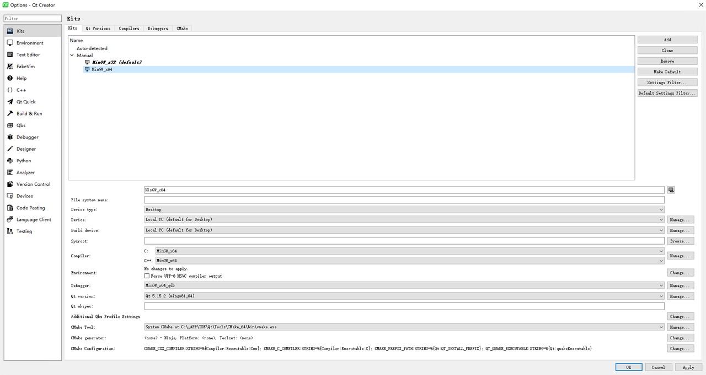
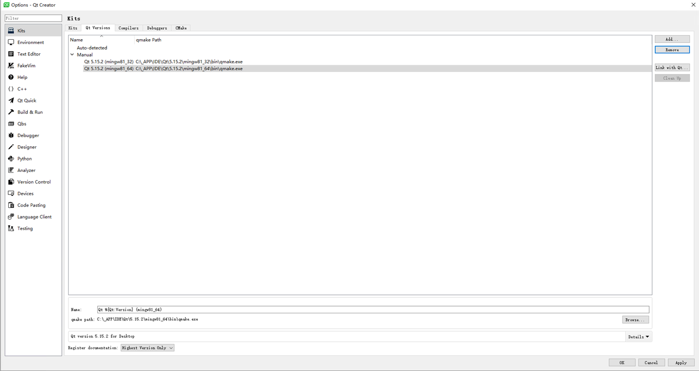
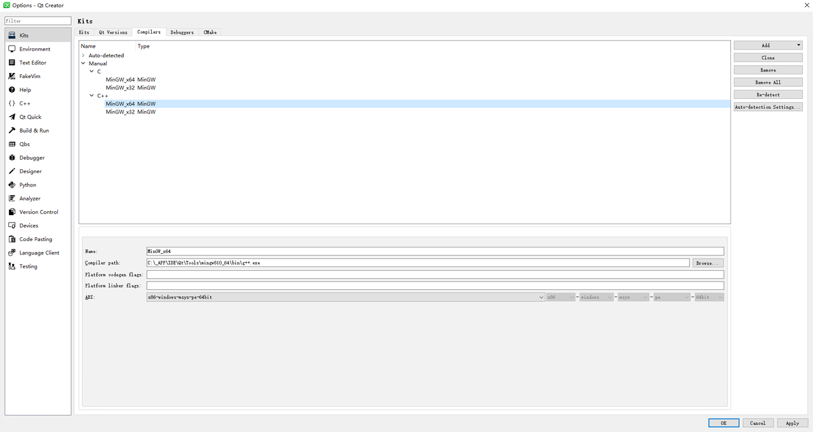
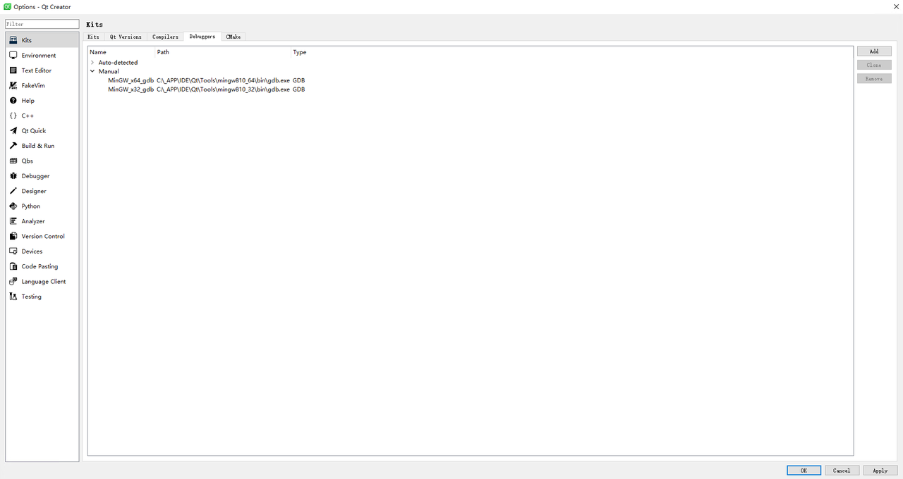
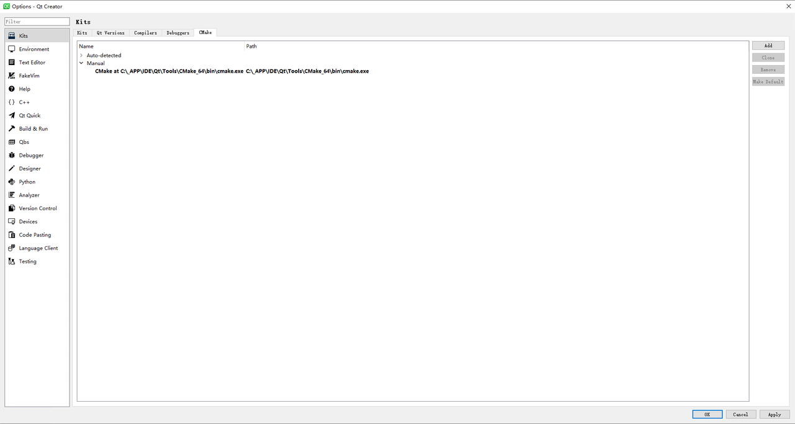
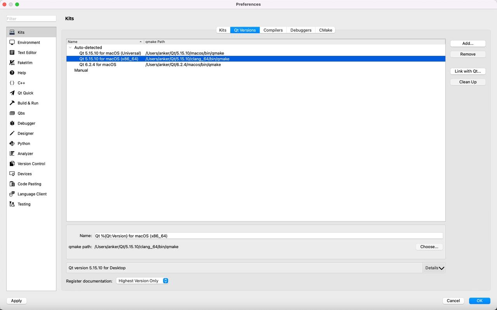
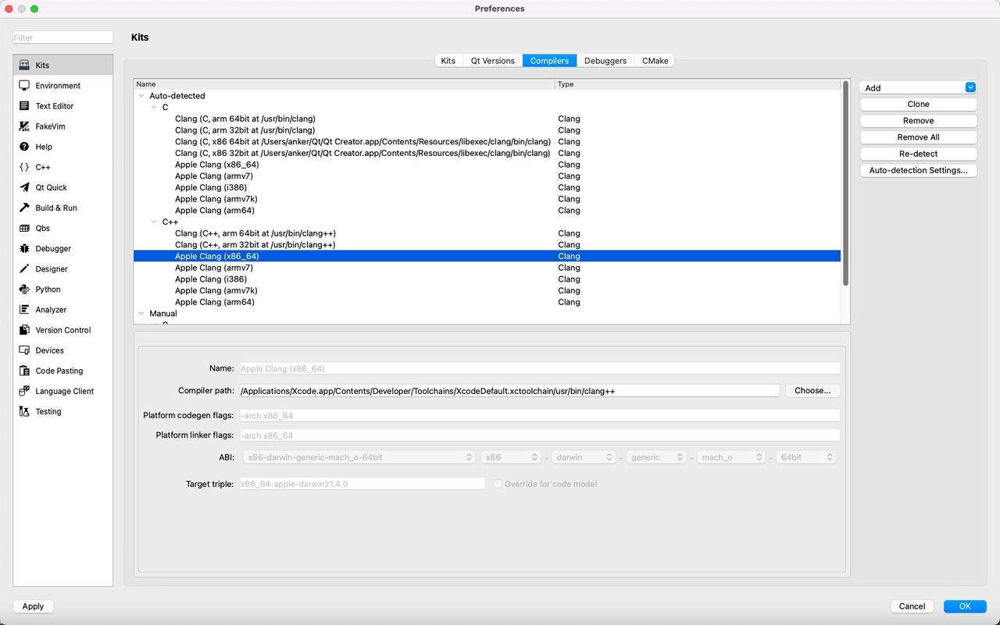
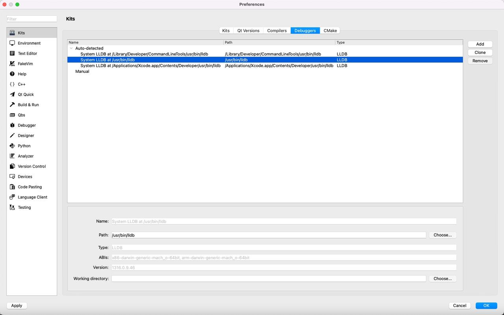
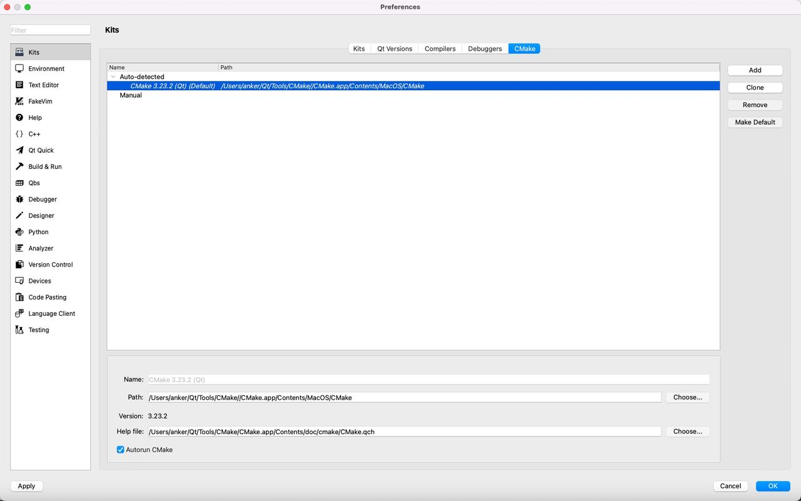

## AnkerMake Slicer

 The AnkerMake Slicer is a toolpath generator for AnkerMake 3D printers: it reads 3D models (STL, OBJ, AMF, 3MF) and converts them into G-code instructions.  The AnkerMake Slicer sends the produced G-code file to the 3D printer and can initiate the print.

​        The AnkerMake Slicer engine is based on version 4.11 of the CuraEngine open-source slicer project. The main program is based on the MeshLab open-source project. We have adopted the plug-in management mechanism to abstract and segment the 3D main interface with the slicer parameter module and the slicer engine process, ensuring low coupling in the framework.

**Main features of the AnkerMake Slicer**

- Basic slicing features and G-Code viewer;

- Remote control and monitoring;

- Hybrid/tree/normal support types, customized support;
- Multi-platform (Win/Mac) support;
- Intelligent and easy exporting slicing parameters;
- G-code path simulation with speed, acceleration, and other parameters closer to the real operation of 3D printers;

**High-speed printing quality optimization**

- Overhang printing effect optimization;
- Small detail printing effect optimization;
- Outer wall single-layer printing quality optimization;
- Motion path optimization;
- Optimization of the hole wall printing effect;
- Micro feature merging and smoothing node jitter;

8. Functions to match AI print monitoring.

## Compiling

#### 1. Windows Compile Guide

1. Environment setup
2. Install the following tools:  
3.    Qt Creator from https://www.qt.io/download

4.    Visual Studio Community 2019 from visualstudio.microsoft.com/vs/ 

5.    MinGW from https://osdn.net/projects/mingw/releases/

6.    CMake from [cmake.org](https://cmake.org/download/)

7. Config the Qt Creator, kits, QT version, compilers, debuggers, CMake







#### 2. Building the AnkerMake Slicer

- Download the codes to a local directory.

- Navigate to the location where you saved the codes, and then open /AnkerSlicer/src/AnkerSlicer.pro with Qt Creator.

- ### Compile the project.

## Mac Compile Guide

### 1 Environment Setup

- Install the following:
  - Xcode from App Store.
  - Qt Creator from https://www.qt.io/download
  - libomp   `brew install libomp`

- Building the AnkerMake Slicer

**There are two ways to build the AnkerMake Slicer.**

Use Qt Creator to build the AnkerMake Slicer

- Download the codes to a local directory.

- Navigate to the location where you saved the codes, and then open /AnkerSlicer/src/AnkerSlicer.pro with Qt Creator.

### 2 Configure the Qt Creator, kits, QT version, compilers, debuggers, and CMake.






### Change omp path in file `AnkerSlicer/src/general.pri`

```shell
 macx:{
        QMAKE_LFLAGS += -L/opt/homebrew/Cellar/libomp/14.0.6/lib/ -lomp #change the value to the right path of omp
        INCLUDEPATH += /opt/homebrew/Cellar/libomp/14.0.6/include/
    }
```

### Compile the project

Run this script to build the AnkerMake Slicer.

- Modify the path of SrcCode, libomp and Qt Creator.
- Save the shell to a file named buildAnkerMake.sh and modify the permissions with the command `chmod +x buildAnkerMake.sh`
- Run `./buildAnkerMake.sh`

``` shell
echo "mac installer build"
CURRENT_DIR=$(dirname "$0")
cd "$CURRENT_DIR"
echo "current dir: "$PWD
CURRENT_DIR=$PWD
tempDate=$(date +"%Y%m%d%s")
tempPath=build_$tempDate
mkdir $tempPath
cd $tempPath
cp -R /Users/anker/AnkerSlicer .  # if you download the src here
cd ./ankerslicer
#complier macos
ompPath="/opt/homebrew/Cellar/libomp/14.0.6" #please change the value to the right path
qmake_path=/Users/anker/Qt/5.15.10/clang_64/bin #please change the value to the right path
export PATH=$PATH:$qmake_path
mkdir build_mac&&cd build_mac
qmake DEFINES+=FORCE_ARM "QMAKE_LFLAGS+=-L$ompPath/lib/ -lomp" "INCLUDEPATH+=$ompPath/include/" ../src/AnkerSlicer.pro
make -j8
```

## License

 The AnkerMake Slicer engine is licensed under the GNU Affero General Public License, version 3. The AnkerMake Slicer engine is based on CuraEngine by Ultimaker. CuraEngine is licensed under the GNU Affero General Public License, version 3. CuraEngine is owned by Ultimaker. 

 The G-code parser is based on Slic3r by Alessandro Ranellucci. Slic3r is licensed under the GNU Affero General Public License, version 3. Slic3r was created by Alessandro Ranellucci with the help of many other contributors.

 The GNU Affero General Public License, version 3, ensures that if you use any part of this software in any way (even behind a web server), your software must be released under the same license.

 The main 3D program is licensed under *GPLv3**.* The main program is based on MeshLab and VCGlib. MeshLab is developed by the University of Pisa, and VCGlib is developed by Visual Computing Lab of the Italian National Research Council - ISTI.

 The *GPLv3* ensures that if you use any part of this software in any way, your software must be released under the same license.

 The AnkerMake Slicer networking plugin is based on non-free libraries. It is optional to the AnkerMake Slicer and provides extended functionalities for users.